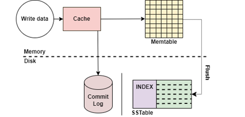
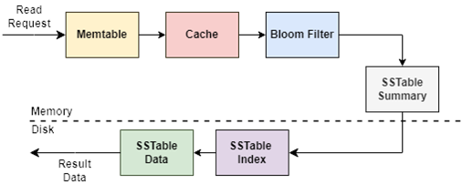

# Database Engine
Project for course Advanced Algorithms and Data Structures.

## Team members
- [Nada Zarić](https://github.com/nadazaric)
- [Selena Milutin](https://github.com/SelenaMilutin)
- [Strahinja Sekulić](https://github.com/StraleXY)
- [Hristina Adamović](https://github.com/hristinaina)

## Project description
Database Engine is a key-value NoSQL storage engine that supports CRUD actions on data. 
A key-value storage engine stores data as key-value pairs, 
where each key is unique and maps directly to a value.
Unlike SQL databases, which can struggle with scalability, complex queries, and rigid schema requirements, key-value stores offer greater flexibility and efficiency for handling large volumes of unstructured data.

Following paragraphs will show the data structures that were implemented and the way they are connected.

## Read path
Operations and commands:
- GET|key
- GET_HLL|key
- GET_CMS|key

The picture above shows the flow of data during the GET operation.

## Write path
Operations and commands:
- PUT|key|value
- DELETE|key
- PUT_HLL|key|precision[4-8]
- PUT_CMS|key|epsilon(0,1)|delta(0,1)

The picture above shows the flow of data during the PUT operation.

## Project Documentation
Complete project documentation can be found in _Dokumentacija.pdf_ file.
